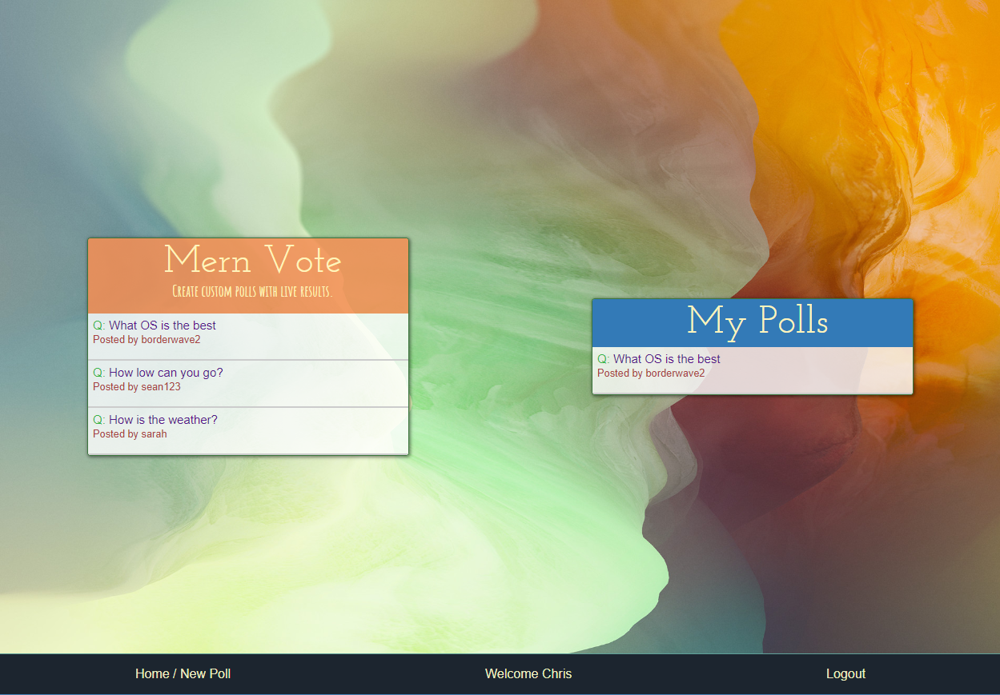

 ### Welcome to MERN Vote

**Basic Outline**:
Hello and welcome to MERN Vote. This app was created as a part of the Back End Development Certificate for freecodecamp.org. As the name implies, this app was written using MongoDB, Express, React and Node. 

**An emphasis on security**:
In designing MERN Vote, I have given special attention to security and I have tried to prevent unauthorized use within the app to the best of my ability. With MERN Vote, anonymous users are allowed to vote on any polls they wish. All other functionality, such as creating, modifying and deleting polls is restricted to authenticated users via authentication on the server.
	Authentication is handled by the npm package bcrypt and a middleware function which validates all user requests against a 50 character random token saved on the database with the user’s account information. When a user logs in, the token is sent to their browser and saved in local storage. Subsequent logins will check for the presence of the token and validate it against the token in the database. Other users who wish to maliciously fake their identity will be unable to do so without the unique token. 
	Initially, I created this application using only weak security, where the user’s credentials were assumed to be genuine. I then considered that this would never fly in a real world application and proceeded to redesign my app using a secure mindset.
	
**Wrapping up**:
	Creating MERN Vote taught me more about development than any other project thus far. For the first time, I went beyond simply “making it work” to incorporating best practices and secure design principles. Going forward, I would like to incorporate more “best practices” in my projects and produce more production-ready software.

**Special Thanks**:
	Thanks to my mentor and friend [Daniel](http://bostwick.github.io/) for your advice and guidance on this project.
	

